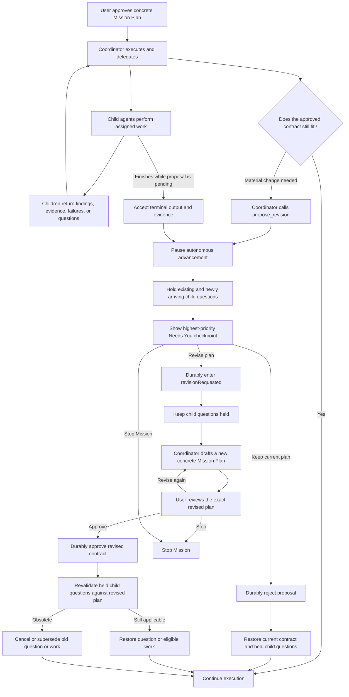

## Context

Coordinator Missions already separate runtime-authored Mission Plan state from trusted user approval. Authority resides in the approved `CoordinatorMissionPlan`; generic updates flow through `CoordinatorMissionPlanUpdate`; user-owned revision logic moves approval to `revisionRequested`; decision/checkpoint projection uses stable identities and stale-submit guards; and post-approval continuation is app-owned.

A Director can discover that the approved contract is no longer suitable, but it cannot safely change that contract or impersonate a user decision. Ordinary evidence, failures, and changed assumptions do not themselves require ratification. A proposal is required only when the proposed remedy changes approved contract fields: objective/scope, predecessor lineage, workstreams, node membership/dependencies/workflow/execution policy/done criteria, planned write/worktree strategy, policy, autonomy, pace, concurrency, pinned context/skills, or guidance.

V1 introduces summary-only proposals. A proposal describes the requested contract-changing remedy and asks the user to choose **Revise plan**, **Keep current plan**, or **Stop Mission**. It does not carry or approve an exact replacement contract. The Director may append a proposal but may not mutate the approved contract, resolve the proposal, record a user decision, or resume authority.

Relevant seams are:

- `CoordinatorFollowThroughState.missionPlan`, `CoordinatorMissionPlanUpdate`, and `updateMissionPlan(_:)` for authoritative Mission state;
- `CoordinatorChatMCPToolService.supportedOps` and its `submit` / `mission_plan` dispatch;
- app-owned `submitPlanRevisionDirective(_:)`, `requestApprovedPlanRevision()`, and `requestPlanRevision(_:)`;
- stable decision/checkpoint projection and stale-submit validation;
- the reusable checkpoint UI, which currently has a general Proceed / Revise / Stop presentation;
- delegated-run policy, Auto-mode boundary classification, follow-through evaluation, and continuation delivery gates.

The existing trust contract permits one trusted approval door and forbids runtime self-approval or approval waivers. Historical autonomous reshape behavior is non-normative and must not be restored.

### V1 Mission revision flow



**Revise plan** authorizes the Coordinator to draft a new concrete contract; it does not approve the suggested remedy. Execution authority returns only after the user approves that exact revised Mission Plan.

### Implementation partial order

- **Audit first:** complete Item 1's contract/seam audit before implementation choices are finalized; the audit records current prerequisite status without claiming any prerequisite is complete.
- **Independent early work:** material-contract snapshot/fingerprint work, proposal/resolution model work in sections 2–3, and most `propose_revision` parsing and pure validation may begin before the 13.x prerequisites complete.
- **Prompt/schema sequencing:** prompt, public input schema, doctor discovery, and overlapping focused tests sequence after `add-coordinator-mode` task 13.6 to avoid conflicting surface edits.
- **Hard integration gate:** pause enforcement, trusted resolution, app-owned Stop, continuation lifecycle, child-question lifecycle, and projection/UI integration in sections 5–8 wait for tasks 13.7 (app-owned Stop/terminal monotonicity) and 13.8 (durable post-approval handoff).
- **Soft/independent:** task 13.3 legacy `not_required` recovery is not a blocker unless the audit demonstrates a shared authority path.

## Goals / Non-Goals

**Goals:**

- Give the owning Director runtime a narrow operation for filing a durable summary-only contract revision proposal.
- Anchor proposal validity to a canonical material-contract snapshot and deterministic fingerprint rather than a general merge counter.
- Preserve append-only proposal/resolution history, conservative canonical request identity for exact pending retries, one unresolved proposal per Mission, and restart safety.
- Pause all autonomous advancement while permitting bounded bookkeeping and terminal reconciliation.
- Resolve proposals only through trusted, CAS-checked, durable user transactions.
- Project one stable Needs You checkpoint with Revise plan / Keep current plan / Stop Mission parity in UI and external MCP submit.
- Keep status, compact fingerprints, waits, events, and minimal receipts honest about proposal lifecycle.
- Preserve valid post-approval continuation authority on filing, restore it after Keep, and invalidate it after Revise or Stop.

**Non-Goals:**

- Exact one-click contract replacement or an **Approve revised plan** action.
- A structured replacement payload, contract diff UI, acceptance-time replacement rebasing, or active-node reconciliation for a replacement.
- Autonomous reshape, Director-declared non-materiality, Director-authored user decisions, or runtime proposal resolution.
- Broad receipt redesign, a second approval door, or changes to historical reference artifacts.
- Treating evidence, failures, tool errors, or changed assumptions as proposals unless the requested remedy changes approved contract fields.
- Adding a separate monotonic `contractRevision` in v1.

## Decisions

### 1. V1 proposals are summary-only and conservatively material

`coordinator_chat op="propose_revision"` accepts a structured summary/rationale plus advisory affected-field categories, remedy category, supporting evidence IDs, and raw `requested_change`. It rejects an exact replacement payload. The public input schema advertises the `propose_revision` op and its fields. Established `coordinator_chat doctor` output adds `propose_revision` to `supported_ops` and exposes `features.revision_proposals = { "version": 1, "representation": "summary_only", "actions": ["revise_plan", "keep_current_plan", "stop_mission"] }` so harnesses can preflight support. The feature object remains doctor-only; the public input schema advertises only accepted op values and fields, with no duplicate capability object or extra wrapper plumbing.

The server validates the owning runtime and current contract identity and classifies material fields where possible. Advisory categories improve diagnostics, presentation, and deduplication but never waive the pause or ratify a replacement. Once filed, every v1 proposal is treated as material.

**Alternative considered:** accept a complete replacement for one-click approval. Rejected for v1 because safe acceptance needs a full diff, acceptance-time rebasing, runtime-field-preserving apply semantics, active-node reconciliation, authority rotation, and a separate validation plan.

### 2. Contract CAS uses a canonical snapshot, not `plan.revision`

`CoordinatorMissionPlan.revision` is a general merge counter. Allowed evidence, terminal bookkeeping, child observations, and continuation-status writes may advance it while a proposal is pending. It is therefore not an authority token.

A shared component produces:

1. a versioned canonical material-contract snapshot;
2. a deterministic SHA-256 fingerprint of that exact snapshot; and
3. material-field classification used by proposal validation and diagnostics.

Structural equality with the persisted base snapshot is the authoritative CAS. The fingerprint is a compact identity for checkpoints, status, diagnostics, waits, and the base-contract component of `canonicalRequestIdentity`. No `contractRevision` is added in v1.

The snapshot includes ratified planned fields: objective/scope, predecessor lineage, workstreams, node membership/dependencies/workflow/execution policy/done criteria, planned write/worktree strategy, policy, autonomy, pace, concurrency, pinned context/skills, and guidance. It excludes runtime worktree IDs, node status, bound sessions/interactions, evidence, decisions, events, child phase observations, terminal provenance, and continuation bookkeeping.

Canonical serialization sorts workstream IDs, node IDs, dependency lists, autonomy keys, pinned context/skills, and every map/set-like value before hashing. Planned write/worktree strategy remains contract state even though assigned worktree IDs and bindings are runtime state.

The same component is used by proposal ingress, approved-contract immutability checks, resolution CAS, pause diagnostics, status/checkpoint projection, and tests.

**Alternative considered:** compare only `plan.revision`. Rejected because unrelated runtime progress makes it both over-sensitive and unsafe as a material-authority identity.

### 3. Proposal state is canonical Mission ledger state with dedicated mutators

Proposal storage belongs under `CoordinatorMissionPlan`, not checkpoint UI state. The checkpoint references proposal ID and contract identity and never duplicates the proposal payload.

A proposal record contains:

- app-owned stable `proposalID`, deterministically minted from Mission/base/request identity plus the next ledger occurrence;
- deterministic `canonicalRequestIdentity` used only to recognize exact logical retries of the current pending request;
- `basePlanID`;
- versioned `baseContractSnapshot`;
- `baseContractFingerprint`;
- representation kind fixed to summary-only in v1;
- summary and rationale;
- advisory affected-field categories and remedy category;
- sorted supporting evidence IDs;
- versioned canonical requested-change value;
- Director/runtime actor metadata; and
- app-owned filing timestamp.

A separate append-only resolution record contains deterministic/app-owned resolution identity and timestamp, user decision/checkpoint linkage, outcome, and resulting contract identity where relevant. Outcomes are `acceptedForConcreteRevision`, `rejected`, `invalidatedContractChanged`, `invalidatedMissionTerminal`, and `stopped`. `acceptedExact` is reserved for a future tranche.

Lifecycle is derived from proposal plus resolution records; proposal records are never mutated in place. Proposal filing also appends a non-decision proposal event attributed to the Director/runtime actor so receipts explain the pause. Filing SHALL NOT append to the user/director decision ledger, use a decision-record shape, or carry user-decision metadata.

Dedicated reducer APIs conceptually provide `appendRevisionProposal` and `resolveRevisionProposal`. Dedicated service environment closures and view-model handlers call them. `CoordinatorMissionPlanUpdate` cannot carry proposal/resolution arrays; generic `mission_plan` structurally preserves them but cannot inject or resolve them.

Older persisted Missions decode with empty proposal/resolution arrays. Fresh-Mission reset clears both collections with the Mission Plan.

**Alternative considered:** store proposal payload in the checkpoint or generic update. Rejected because UI is projection, and generic updates would become an injection/self-decision back door.

### 4. Canonical request identity supports exact pending-retry idempotency

The server derives `canonicalRequestIdentity` from:

```text
identity format version
+ base contract identity
+ sorted affected contract-field categories
+ remedy category
+ sorted supporting evidence IDs
+ canonical requested-change value
```

The canonical requested-change transform is deliberately conservative and versioned: apply Unicode NFC, trim surrounding whitespace, and collapse each internal whitespace run to one ASCII space while preserving case, punctuation, and all other characters. Summary, rationale, timestamps, and app-owned metadata are excluded. A summary/rationale-only retry with the same raw requested change and structured identity fields maps to the same identity. Differently written requested changes—including case or punctuation differences—may produce a different identity even if a human considers them similar; v1 does not claim semantic equivalence.

`canonicalRequestIdentity` is used only for exact logical retry idempotency while a matching proposal is pending. The pending proposal's stable `proposalID` is returned for an identical retry. A different canonical request while one proposal is pending is rejected and reports the pending proposal ID. After any resolution, v1 keeps no rejection-suppression key: the same or differently worded request may create a new proposal occurrence with a new proposal ID against the applicable base. First resolution wins, identical resolution retry is idempotent, and conflicting Revise/Keep decisions are stale.

Mission completion and Stop append the applicable resolution atomically before terminal freezing.

**Alternative considered:** aggressive case/punctuation normalization or semantic anti-nag suppression. Rejected because it would overclaim equivalence and could suppress a legitimately different request.

### 5. Proposal ingress is runtime-owned but resolution is user-owned

`coordinator_chat op="propose_revision"` is allowed only to the verified owning Coordinator runtime. External callers, internal non-owner workers, absent caller identity, cross-Mission requests, unapproved Missions, terminal Missions, and stale base-contract identity fail closed.

Successful ingress appends only canonical proposal state plus a non-decision Director/runtime-attributed proposal event through the dedicated mutation path. It does not append any decision-ledger record and does not change approval state, contract fields, user decisions, node starts, bindings, or proposal resolutions.

Proposal resolution uses an app-owned transaction carrying action, proposal ID, expected contract identity, and expected checkpoint instance ID. It validates authoritative current state:

- proposal exists and is unresolved;
- Mission is nonterminal;
- proposal ID and checkpoint instance match the rendered proposal;
- expected identity matches the proposal base; and
- current canonical snapshot structurally equals the proposal base snapshot.

Both Revise and Keep require this CAS. Stop is target-bound but stale-tolerant because it withdraws consent. Runtime/internal non-owner callers cannot invoke resolution paths.

Any other trusted action that changes contract identity—manual plan revision, another revision checkpoint, or trusted pace, `childAsk`, autonomy, or policy changes included in the snapshot—atomically appends `invalidatedContractChanged` for the pending proposal inside the same authoritative generation as the contract change. That generation also invalidates old-contract continuation authority, installs the durability hold, and removes the proposal checkpoint. Only after the generation persists may existing unanswered child interactions return to ordinary projection and policy under the resulting contract; follow-through requires fresh authority under that contract. If revision is still desired, the Director must file a new proposal against the new canonical base contract; the old proposal cannot be reused or resolved.

### 6. Durability gates every authority transition

No transition creates or restores authority from in-memory state alone. The required ordering is:

1. Proposal append installs the authoritative pause.
2. The app persists the proposal generation.
3. Only after the generation-aware persistence barrier succeeds may `propose_revision` return success.
4. Each Revise, Keep, or Stop transaction creates one authoritative generation containing the proposal resolution, linked trusted user decision, approval or terminal state transition, and the corresponding continuation invalidation or restoration state. For Revise this includes `revisionRequested` and invalidation of old-contract continuation; for Keep it includes the rejected resolution and restoration marker while the durability hold remains active; for Stop it includes terminal state and continuation invalidation.
5. Installing that generation also installs an explicit durability hold that overrides any apparently approved or restored in-memory authority.
6. The app awaits the generation-aware persistence barrier for the entire generation, not for its fields independently.
7. Only after that exact generation persists may the durability hold clear and eligible evaluation, child-question availability, resume, start/continuation enqueue, or restored authority become visible to policy gates.
8. If the barrier fails, the durability hold remains fail-closed; no approved authority may resume from the in-memory resolution, and retry/reload must reconcile from the last durable generation.
9. Every final start or continuation enqueue revalidates that no proposal or durability hold is pending and Stop has not won the race.

This ordering eliminates a crash window in which an in-memory resolution could expose approved authority before its linked decision, approval/terminal state, and continuation disposition are durable. Stop wins every race. A pending proposal survives restart and reprojects the same Needs You checkpoint.

**Alternative considered:** update UI immediately and persist asynchronously. Rejected because a crash or concurrent gate could resume authority without a durable decision.

### 7. Pending proposals impose an explicit advancement pause

Terminal reconciliation occurs before the proposal hold so already-running work can settle honestly. All new advancement is held.

| Operation or transition while pending                                   | Result                                                                                  |
| ----------------------------------------------------------------------- | --------------------------------------------------------------------------------------- |
| New `agent_run` / `agent_explore`, including planning exceptions        | Block                                                                                   |
| Director `childAsk:auto` or other automatic user-surrogate decision     | Block                                                                                   |
| Automatic follow-through, gate-cleared resume, or continuation dispatch | Block/defer                                                                             |
| Coordinator-only node completion                                        | Block                                                                                   |
| New node start or new session/interaction binding                       | Block                                                                                   |
| Runtime plan-progress mutation that advances work                       | Block                                                                                   |
| Generic `mission_plan` contract change                                  | Block                                                                                   |
| `pending → running` or `blocked → running`                              | Reject                                                                                  |
| New binding on a previously unbound node                                | Reject                                                                                  |
| Mission status change implying new work started                         | Reject                                                                                  |
| Director-authored user decision                                         | Reject                                                                                  |
| Terminal output from already-running children                           | Allow                                                                                   |
| Evidence, failure, changed-assumption bookkeeping                       | Allow                                                                                   |
| `running → blocked`                                                     | Allow                                                                                   |
| `running/blocked → terminal` when evidence rules pass                   | Allow                                                                                   |
| Answer submit for any persisted child question                          | Fail closed without recording an answer; expose reason `held pending revision proposal` |
| External user Stop                                                      | Allow and win races                                                                     |
| Status, wait, event, receipt observation                                | Allow                                                                                   |

Enforcement is defense-in-depth: delegated-run policy checks before preapproval exceptions/capacity; Auto-mode classifier emits an early proposal hold; follow-through evaluation checks after terminal reconciliation but before continuation/resume; MCP `mission_plan` uses the transition table; reducer mutators reject forbidden state changes.

### 8. Continuation and child-question lifecycle follow proposal outcome

Filing a proposal defers an otherwise deliverable post-approval continuation with a proposal-specific reason; it does not invalidate it. The proposal becomes the highest-priority active checkpoint. Existing child questions and questions newly arriving from already-running children remain persisted in their existing interaction state but are unavailable/disabled with reason `held pending revision proposal`. Submit attempts fail closed and record no answer.

- **Keep current plan:** the single authoritative generation contains `rejected`, the linked user decision, unchanged approved state, and restored continuation disposition; after it persists, any still-pending child interaction becomes active/answerable again and eligible follow-through evaluates once.
- **Revise plan:** the single authoritative generation contains `acceptedForConcreteRevision`, the linked user decision, `revisionRequested`, and invalidation of old continuation authority; child questions remain held throughout `revisionRequested` and concrete revised-plan drafting. After revised-plan approval persists, each question is revalidated against the new plan and restored only if still applicable; otherwise it is canceled/superseded without an answer.
- **Stop Mission:** the single authoritative generation contains `stopped` or terminal invalidation, the linked Stop decision, terminal state, and continuation invalidation; all held child questions are canceled.
- **Mission or child terminalizes independently:** accept terminal completion. A terminal child removes its now-obsolete persisted question; Mission terminalization appends `invalidatedMissionTerminal` before terminal freezing.

Every eventual start or continuation enqueue rechecks pending state and Stop precedence.

### 9. Projection is stable, proposal-specific, and state-derived

Projection adds exactly one revision-proposal decision source/reference and resolves display data from canonical `rail.missionPlan` by proposal ID at render time. While pending, the proposal is always the highest-priority active checkpoint. Persisted child questions remain visible only as unavailable/disabled state with reason `held pending revision proposal`; they do not compete for active checkpoint selection.

Checkpoint identity is scoped by Coordinator session, proposal ID, and contract fingerprint, conceptually:

```text
coordinator:<session-id>:revision-proposal:<proposal-id>:contract-<fingerprint>
```

Action arguments contain proposal ID plus expected contract/checkpoint identity, not a duplicate replacement payload. UI and external MCP submit expose:

- `checkpoint_action: "revise_plan"`;
- `checkpoint_action: "keep_current_plan"`; and
- existing Stop behavior.

The checkpoint card labels are exactly **Revise plan**, **Keep current plan**, and **Stop Mission**.

Checkpoint precedence is:

1. pending revision proposal;
2. pending selected-Mission child interaction when no proposal is pending;
3. concrete plan approval;
4. step boundary.

Plan approval and step boundary should normally be unreachable during a pending proposal because the Mission remains approved and follow-through is held; the explicit order keeps projection deterministic under recovery or inconsistent legacy state.

### 10. Discovery and proposal lifecycle are observable without broad receipt redesign

Doctor advertises `propose_revision` in `supported_ops` and exposes `features.revision_proposals = { "version": 1, "representation": "summary_only", "actions": ["revise_plan", "keep_current_plan", "stop_mission"] }` for harness preflight; public input schema advertises only the op and accepted fields. Mission status, compact status, wait fingerprints, and the event journal expose stable lifecycle data: pending proposal ID, base contract identity, representation kind, summary, material fields, lifecycle/outcome, checkpoint instance, Revise/Keep submit hints, held child-question state/reason, and recent resolution IDs/outcomes.

Proposal identity/status/contract parts are included directly in compact fingerprints and event-journal candidates so append/resolution wakes `wait_for_update` even if the generic plan revision does not capture a dedicated mutator. Receipt enrichment remains minimal: it records enough proposal and resolution history to explain pauses and outcomes.

### 11. Exact one-click replacement is a separate tranche

If exact replacement is later introduced, its action is named **Approve revised plan** and it requires a complete structured replacement/diff, acceptance-time rebasing, runtime-field-preserving apply logic, active-node reconciliation, continuation-authority rotation, diff UI, and dedicated tests. None of those payloads or acceptance semantics are accepted in v1.

## Risks / Trade-offs

- **Wrong CAS anchor** → use structural equality of the versioned canonical snapshot; use its fingerprint only as compact identity and diagnostics.
- **Canonicalization drift** → centralize snapshot creation/classification, sort every map/set-like input, version the snapshot, and share the component across ingress, mutation checks, projection, and tests.
- **Generic update back door** → omit proposals/resolutions from `CoordinatorMissionPlanUpdate`; dedicated mutators own append and resolution.
- **Durability race** → commit resolution, linked decision, approval/terminal state, and continuation disposition as one authoritative generation under an explicit durability hold; clear the hold only after that exact generation persists and keep it fail-closed after barrier failure.
- **Continuation loss or misfire** → defer on filing, restore only after durable Keep, invalidate after durable Revise/Stop, and revalidate at enqueue.
- **Checkpoint fatigue** → proposals are only for remedies changing approved contract fields; ordinary evidence/failure bookkeeping stays ordinary.
- **Conflicting decisions** → first resolution wins, identical retries are idempotent, conflicting retries fail stale, and Stop wins races.
- **Old binary rollback** → do not revert while a Mission has a pending proposal; resolve or Stop it first.
- **Broad receipt scope** → expose minimal lifecycle history and defer receipt redesign.
- **Future exact-approval pressure** → reject exact replacement payloads in v1 and keep `acceptedExact` reserved but unreachable.

## Migration Plan

1. Run the Item 1 audit and record current 13.3/13.6/13.7/13.8 status without asserting completion.
2. In parallel where safe, add/test canonical contract identity, canonical request identity, backward-compatible proposal/resolution models, pure parsing, and validation.
3. After task 13.6, update prompt, public input schema, doctor discovery, and overlapping tests.
4. After hard integration prerequisites 13.7 and 13.8, add persistence-gated pause/resolution/Stop/continuation/child-question/projection integration.
5. Add UI/MCP actions, status/fingerprint/wait/event fields, and restart reprojection within those gates.
6. Run focused, integration, strict OpenSpec, and live narrative validation before enabling the operation.

Rollback to a pre-feature build is unsafe while any proposal is pending because an older decoder may ignore unknown fields and resume work. Operational rollback requires resolving the proposal with Keep/Revise or stopping the Mission before installing the older build. Failed persistence or incomplete migration remains fail-closed.

## Validation Matrix

| Contract area               | Focused validation                                                                                                                                                                                                      | Integration/live validation                                                                                                         |
| --------------------------- | ----------------------------------------------------------------------------------------------------------------------------------------------------------------------------------------------------------------------- | ----------------------------------------------------------------------------------------------------------------------------------- |
| Canonical contract identity | every material field included; runtime fields excluded; sorted deterministic encoding; structural CAS; fingerprint stability                                                                                            | status/checkpoint identities remain stable across evidence-only mutations                                                           |
| Proposal ingress            | owning-runtime scope; approved/nonterminal requirement; stale base rejection; summary parsing; exact payload rejection                                                                                                  | Director files one summary proposal through `propose_revision`                                                                      |
| Canonical request identity  | versioned Unicode NFC; surrounding trim; whitespace collapse; case/punctuation preservation; summary/rationale exclusion; exact pending retry idempotency; no rejection-suppression key                                 | identical pending retry returns the same proposal while differently written or post-resolution requests may create a new occurrence |
| Ledger/persistence          | append-only records; dedicated mutator only; empty decode defaults; reset; restart; terminal invalidation                                                                                                               | restart reprojects the same pending proposal checkpoint                                                                             |
| Pause gates                 | starts/planning exceptions; childAsk:auto; follow-through; continuation; coordinator-only completion; node starts/bindings; progress mutations; contract changes all held                                               | live narrative shows no execution before user resolution                                                                            |
| Held child questions        | existing/new child questions persist disabled; submits fail without answer record; Keep restores; Revise holds through drafting then revalidates after approval; Stop cancels; child terminal removes obsolete question | restart preserves the disabled interaction state and proposal remains highest-priority checkpoint                                   |
| Revise plan                 | proposal/checkpoint/contract CAS; durable accepted resolution; `revisionRequested`; old continuation invalidated; later exact plan approval required                                                                    | Director proposal → Revise plan → concrete plan → user approval → execution resumes                                                 |
| Keep current plan           | CAS; durable rejected resolution; contract unchanged; deferred continuation restored; evaluation occurs once                                                                                                            | focused/integration coverage; not required in first live narrative                                                                  |
| Stop Mission                | stale-tolerant target binding; atomic stopped/invalidation record; terminal monotonicity; race precedence                                                                                                               | focused/integration coverage                                                                                                        |
| Projection/actions          | one queue row/checkpoint; identity stability; precedence; labels; UI/MCP parity; no duplicated payload                                                                                                                  | user sees Revise plan / Keep current plan / Stop Mission                                                                            |
| Observability               | status fields; compact fingerprint change; wait wake; journal candidate; recent resolution outcome                                                                                                                      | external waiter wakes on append and resolution                                                                                      |
| Trust/back doors            | runtime self-resolution; user-decision impersonation; generic update injection; exact ratification all rejected                                                                                                         | external submit remains the only resolution path                                                                                    |
| OpenSpec                    | strict validation of all five deltas and apply-ready status                                                                                                                                                             | `openspec validate add-coordinator-plan-revision-proposals --strict`                                                                |

## Open Questions

No product questions remain for v1.

Implementation must confirm the exact current Swift field names for done criteria, policy guidance, pinned context/skills, and planned write/worktree strategy before coding the canonical snapshot. It must also decide whether the snapshot/proposal types remain in `CoordinatorFollowThroughState.swift` or move to a sibling runtime file, and verify whether the existing generation-aware persistence barrier can be reused. These are builder choices and do not change the contract above.
